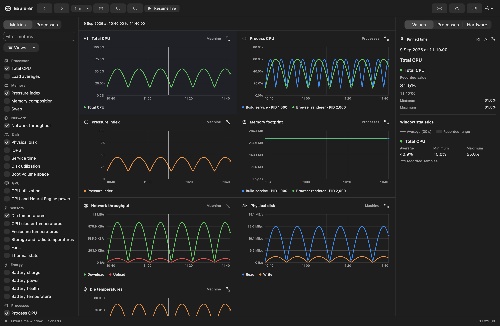
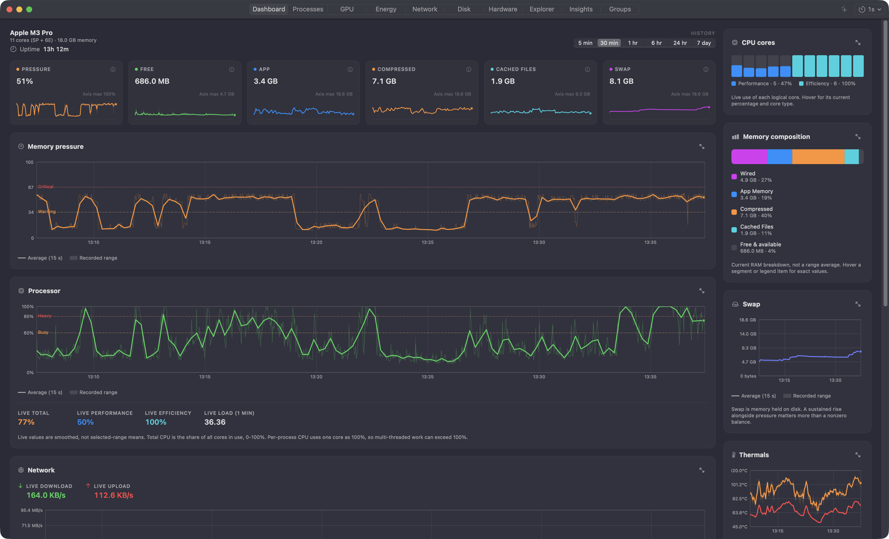
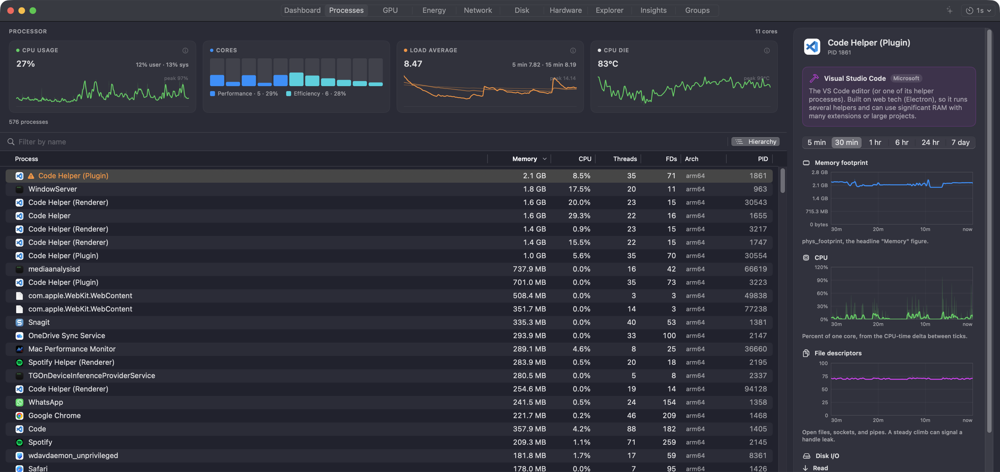
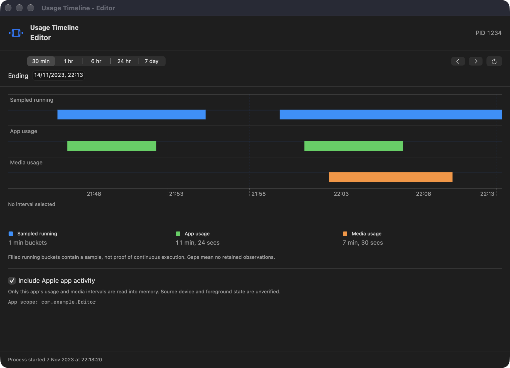
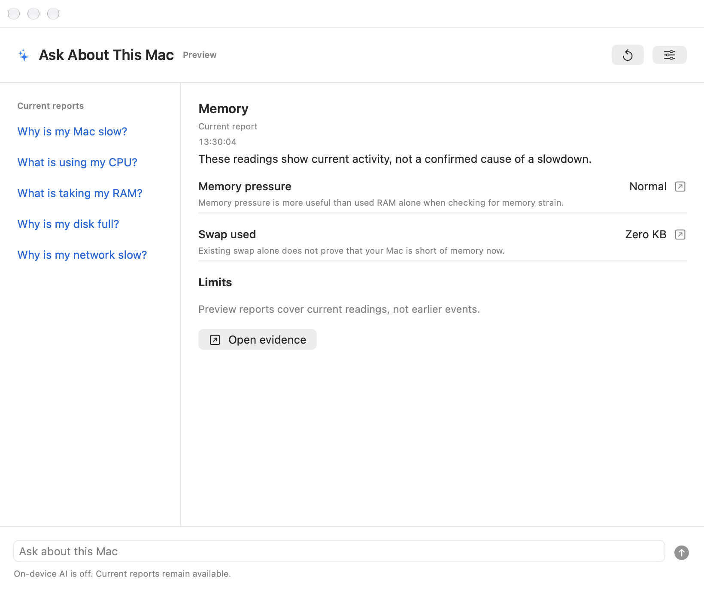
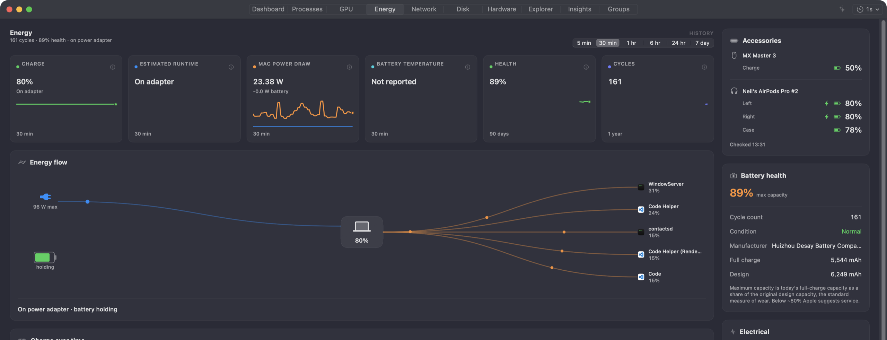
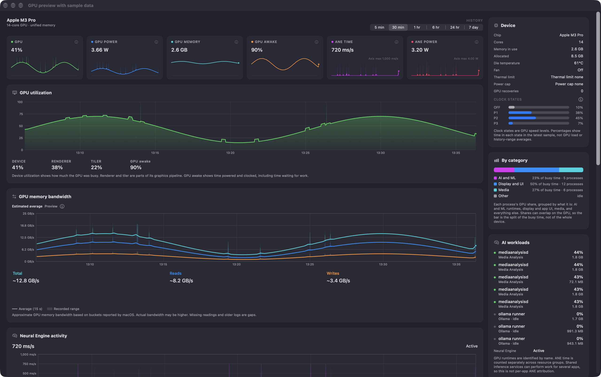
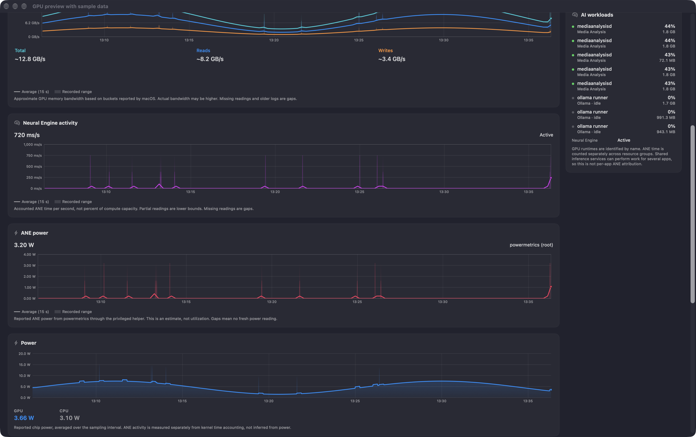

# Mac Performance Monitor

[](https://github.com/Zesty0wl/mac-performance-monitor/actions/workflows/ci.yml?query=branch%3Amain)
[](https://github.com/Zesty0wl/mac-performance-monitor/releases/latest)
[](https://github.com/Zesty0wl/mac-performance-monitor/releases)
[](https://formulae.brew.sh/cask/mac-performance-monitor)
[](https://github.com/Zesty0wl/mac-performance-monitor/stargazers)

[](#install)
[](#install)
[](Package.swift)
[](#install)
[](#privacy)
[](https://crowdin.com/project/mac-performance-monitor)
[](LICENSE)

A native macOS **performance monitor and recorder**. See what your Mac is doing
now, then go back to the moment a slowdown or spike began. Compare CPU, memory,
GPU, network, disk, battery, and sensor readings with the processes behind them.

Use it as a live menu bar readout, a quiet background recorder, or a window you
open when needed. The menu bar and history recorder have separate switches.

Free and open source. No usage telemetry. Recorded samples stay on your Mac.

[2.2 release notes](RELEASE_NOTES.md) · [Changelog](CHANGELOG.md) ·
[Documentation](docs/README.md)

[](docs/images/explorer.png)

## New In 2.2

This update adds more GPU history, an opt-in Ask preview, process usage timelines,
and saved time ranges. The app still supports Apple silicon Macs on macOS 15 or later.

- **GPU and Neural Engine:** Total, Reads, and Writes share a historical
  bandwidth chart, marked Preview because the values are estimates from macOS
  buckets. ANE Time and ANE Power are separate readings and charts. ANE Time
  needs macOS 27; ANE Power needs the approved Full Coverage helper. GPU Memory
  and GPU awake now have recorded detail charts.

- **Ask About This Mac (Preview):** use current reports without AI, or opt in
  to local questions and evidence-based explanations. Apple on-device is the
  default where supported. Optional Qwen3, Qwen3.5, and DeepAnalyze choices keep
  their own downloads. AI cannot run commands or change settings, and answers
  can still be wrong. Siri and Shortcuts sharing needs separate consent.

- **Usage Timeline:** right-click a process to see when the recorder observed
  it running. Optional Apple app and media activity needs Full Disk Access and
  a per-window opt-in. It is not verified foreground-use history.

- **Saved ranges:** history views start at 30 minutes and remember their own
  range. Explorer also keeps your chosen zoom span.

New history grows from new recordings; older logs stay gaps for fields they
never stored. See the [release notes](RELEASE_NOTES.md) for requirements and
limits, and the [release checklist](docs/release-checklist.md) for verification details.

## New In 2.1

All six Energy cards open larger charts and explanations. Charge, runtime,
Mac power draw, and battery temperature have their own detail ranges. Health
and Cycles show daily history over months and years, kept separate for each
battery pack. Long-term history grows from new readings with recording on.

Runtime uses macOS estimates or recent steady use. A dashed forecast stays
separate from real charge data. It assumes the same workload, not a fixed
promise of how long the battery will last.

The Accessories panel shows the battery levels macOS reports for mice,
keyboards, AirPods, and other devices. Optional low-battery alerts live in
Settings > Alerts. Checks run at most once a minute; unknown values stay unknown.

Process detail and Explorer can show earlier, non-overlapping runs of the same
program, with gaps at restarts. The Dashboard also shows uptime and the boot date.

[Energy guide](docs/energy-design.md)

## New In 2.0

### Explorer: Investigate A Moment

Explorer replaces the Analytics start screen with a workspace for live and
recorded data. Pick a time, add the signals you need, and compare up to eight
processes, including ones that have exited.

Hover to move a shared cursor across the charts. Click to pin a time. Hold
**Command and scroll** to zoom around the pointer; ordinary scrolling still
moves the page. Use a grid, a list, or an expanded chart for a closer look.

The inspector shows source values, timestamps, known bounds, and stored machine
rows. Export the visible data as CSV, or share process history in a trace file.
Older data keeps its retained resolution; zooming does not invent detail.
Hardware inventory is a current snapshot, separate from history.

[Explorer guide](docs/explorer-design.md)

### Alerts Based On Change

High swap usage alone is not a reason to warn you. The new rules look for
continued growth or paging strain. They can report further worsening without
first waiting for usage to fall below an old fixed limit.

Process-growth checks reject stale readings and growth that has settled.
Modest findings stay as quiet observations, not a diagnosis of a memory leak.
A separate fast-growth check can catch runaway use without waiting 20 minutes.

Click the menu bar alert badge for active issues and their evidence. Snooze an
ordinary alert for an hour, or open it in Explorer at the relevant time.
Related memory alerts share a notice, and only critical notices request sound.

[Adaptive alert rules and limits](docs/adaptive-alerts.md)

### Upgrading From 1.x

Existing alert choices and history carry forward. The old swap threshold is
no longer used, but explicit process-memory budgets remain available. Alert
state is local and separate from full history recording. New database fields
preserve detail from new samples; they cannot restore missing older readings.

Back up the app's data before testing a downgrade. Review the
[upgrade notes](CHANGELOG.md#upgrade-notes) and [privacy policy](SECURITY.md)
before sharing trace files, reports, or screenshots.

### Clearer Charts And Details

Dashboard and Explorer charts show a clear average over the translucent recorded
range. Short bursts stay visible, missing readings stay missing, and historical
shapes remain stable as new data arrives.

Dashboard cards open larger detail views with values and explanations. The
menu bar panels keep stable layouts as readings change. The Dock icon follows
the window, with a setting to keep it visible.

## Monitor Your Mac

- **Processes:** sort and filter the process table, inspect memory and CPU
  history, and check file descriptors, disk I/O, and Rosetta status.
  Right-click a row and choose **Usage Timeline** for sampled running history.
  Optional Apple app and media activity appears separately, with unverified
  device and foreground status. It requires Full Disk Access and a per-window
  opt-in; the app keeps these activity records in memory only.

- **Groups:** collect related apps and helpers into a group and track their
  combined footprint as a share of the Mac's memory.

- **Energy:** view battery health, charge, power flow, temperatures, fans, and
  the processes using the most energy.

- **Network:** follow download and upload rates, inspect adapters, and enable
  per-app traffic tracking to see which apps use the network.

- **Disk:** chart throughput, IOPS, and service time. Inspect drive health,
  volume space, and the processes doing the most I/O.

- **Disk Map:** scan a disk or folder, explore its space as a treemap, and find
  large or old files. Reveal items in Finder or open Quick Look.

- **GPU:** see device and per-process activity, power, memory, and thermal
  limits. The bandwidth preview adds history beside separate ANE time and
  power, and recorded GPU memory and awake time. Recognize AI runtimes such
  as Ollama, MLX, and LM Studio.

- **Hardware:** browse a searchable inventory of the chip, memory, displays,
  storage, and connected devices. Refresh on demand or save a report.

- **History and diagnostics:** choose recording detail and retention, find top
  consumers over time, and investigate processes with on-device diagnostics.

## Screenshots

GPU, Ask, and Usage Timeline examples use the real native views with sample
data. They illustrate the interface, not a benchmark or a verified AI diagnosis.
Capture details are in the [release checklist](docs/release-checklist.md).

### Dashboard

The current overview: pressure, memory, CPU, network, disk, and thermal trends.

[](docs/images/dashboard.png)

### Processes

A live process table with a detailed inspector for the selected process.



### Process Usage Timeline

Sampled running history and optional Apple activity occupy separate lanes.
This example uses sample data, not a person's activity records.



### Ask Preview

Current measured reports remain available with AI off. This example uses
sample readings. Questions, explanations, and Siri sharing have separate controls.



### Energy

Battery health, power flow, and accessory batteries. This overview is cropped
to leave the battery serial number out of the image.



### GPU

GPU memory and awake-time history, separate ANE cards, and the bandwidth
Preview chart. The approximation caveat appears once beneath the chart.
This current-source capture uses sample readings.



ANE Time and ANE Power have independent units and history. These are sample
readings, not evidence that an app used a particular processor.



## Install

For the latest published build, download `MacPerformanceMonitor.pkg` from
[Releases](https://github.com/Zesty0wl/mac-performance-monitor/releases/latest)
and double-click it. Published packages are Developer ID signed and notarized
by Apple. Sparkle handles app updates.

### Homebrew

```sh
brew install --cask mac-performance-monitor
```

This installs the same signed, notarized pkg from the main
[homebrew-cask](https://github.com/Homebrew/homebrew-cask) repository. Homebrew's
version can lag a new release until its cask update lands. The app also keeps
itself current through Sparkle.
To include it in `brew upgrade`, pass `--greedy`.

### Build From Source

```sh
git clone --branch main https://github.com/Zesty0wl/mac-performance-monitor.git
cd mac-performance-monitor
swift build
swift test
Scripts/run.sh
```

You need Apple silicon and macOS 15 (Sequoia) or later. Building the current
preview app bundle needs Xcode 27 for its App Intents metadata. Core builds
and tests use Swift 6. The optional local-inference worker also needs Xcode's
Metal Toolchain: install it with `xcodebuild -downloadComponent MetalToolchain`.
Bundling needs Xcode's `xcstringstool` too. Model weights download separately.
The run script uses a signing identity when available, or falls back to ad-hoc
signing. Ad-hoc builds cannot use the privileged helper. See
[CONTRIBUTING.md](CONTRIBUTING.md) for signing options and test coverage.

## Privacy

No usage telemetry or analytics. Recorded performance data and alert evidence
stay on your Mac. Exports leave it only when you choose to share them.

Update checks, model downloads, signed content downloads, and network tools
make network requests. They do not upload your recorded performance history.
Ask uses local models and clears its conversation when closed. Optional Siri
and Shortcuts sharing follows Apple's processing rules and can pass results
to other actions. See [Security and privacy](SECURITY.md) for these separate choices.

## Contributing

Contributions are welcome. See [CONTRIBUTING.md](CONTRIBUTING.md) and the
[Code of Conduct](CODE_OF_CONDUCT.md). Security reports go through
[SECURITY.md](SECURITY.md).

The app ships in English, Simplified Chinese, German, and French. German and
French began as AI translations and await review by native speakers. New 2.0
strings in Simplified Chinese also include generated copy awaiting review.
Translate or review in your browser on
[Crowdin](https://crowdin.com/project/mac-performance-monitor), or edit one file and open a
pull request. See [TRANSLATING.md](TRANSLATING.md) for the translation history
and review process.

## License

Released under the [MIT License](LICENSE). Bundles
[GRDB.swift](https://github.com/groue/GRDB.swift) (MIT) and
[Sparkle](https://sparkle-project.org) (MIT). Local inference also uses
[MLX](https://github.com/ml-explore/mlx-swift) and
[llama.cpp](https://github.com/ggml-org/llama.cpp), with their dependency licences
in the app bundle. Model downloads include their own licence and attribution files.
